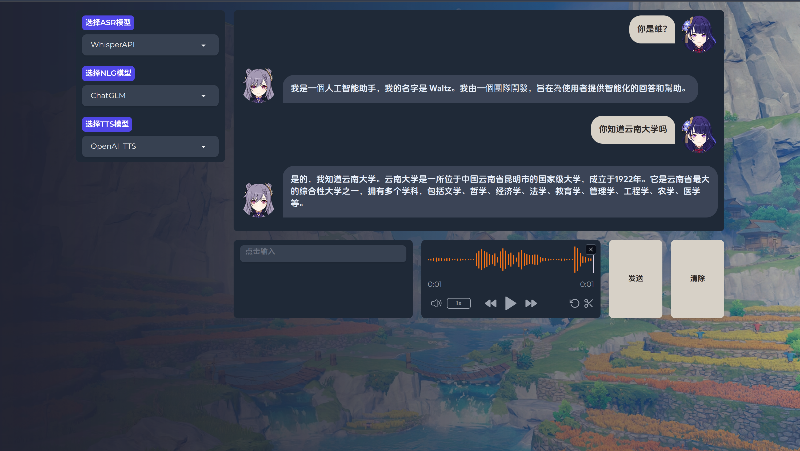

# Chatbot Client

> 本项目为[Wozzilla](https://github.com/orgs/Wozzilla)的Chatbot项目的客户端，WebUI基于[Gradio](https://www.gradio.app/)
> 搭建，分布式部署与网络通讯基于[Flask](https://github.com/pallets/flask)
> 和[Requests](https://requests.readthedocs.io/en/latest)实现

## 效果展示

## 使用方法

> 请注意，应首先启动推理端服务，再启动前端界面进程，允许前端界面和若干推理端服务在不同服务器中运行，但请确保不同服务器之间可以通过网络通讯。

### 客户端

> 请确保已安装ffplay并配置好环境变量，否则将无法自动播放语音。

1. 克隆仓库：`git clone https://github.com/Wozzilla/Chatbot-Client.git`
2. 安装依赖：`pip install -r requirements.txt`
3. 配置相关信息(所有配置文件均在`config.json`中)
4. 通过`python -u gradio-app.py`启动客户端。

### 推理端 ChatGLM3

1. 克隆仓库：`git clone https://github.com/Wozzilla/ChatGLM3.git`
2. 安装该仓库的依赖：`pip install -r requirements.txt`
3. 通过`python -u nlg_server.py`启动服务。

### 推理端 Whisper

1. 克隆仓库：`git clone https://github.com/Wozzilla/Whisper.git`
2. 安装该仓库的依赖：`pip install -r requirements.txt`
3. 通过`python -u tts_server.py`启动服务。

### 推理端 Bert-VITS2

1. 克隆仓库：`git clone https://github.com/Wozzilla/Bert-VITS2.git`
2. 安装该仓库的依赖：`pip install -r requirements.txt`
3. 通过`python -u tts_server.py`启动服务。

## Co-Authors

