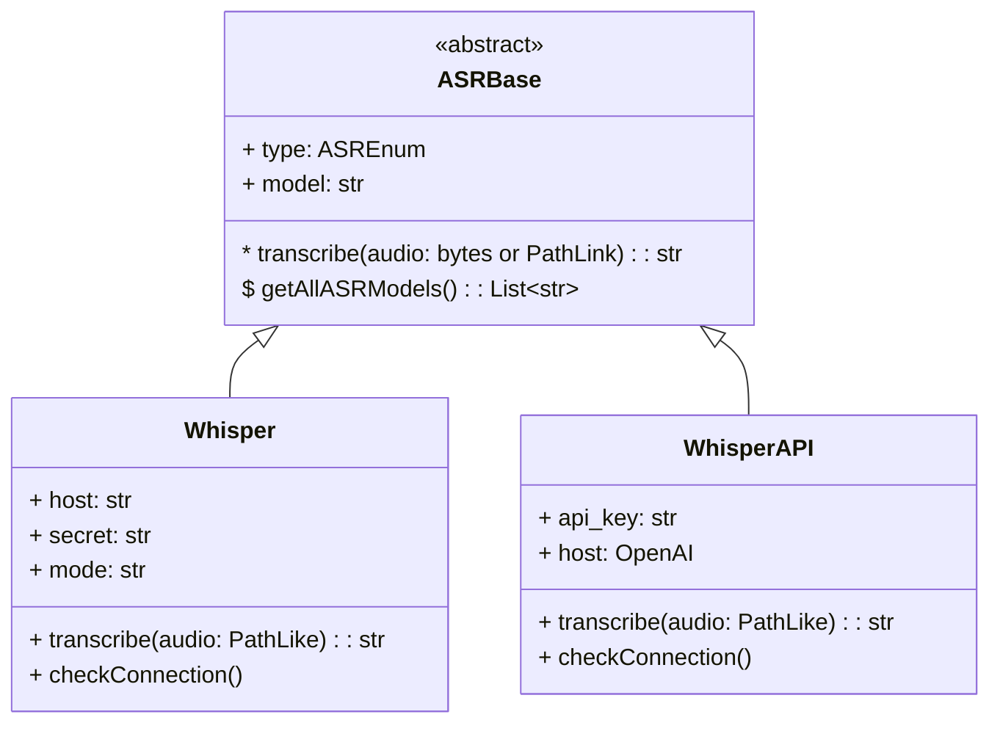
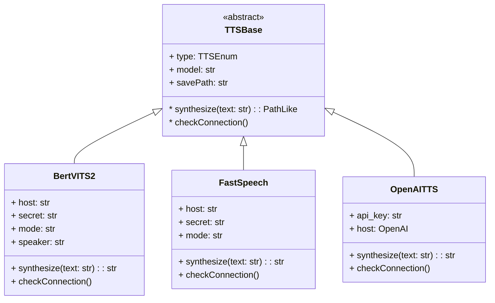
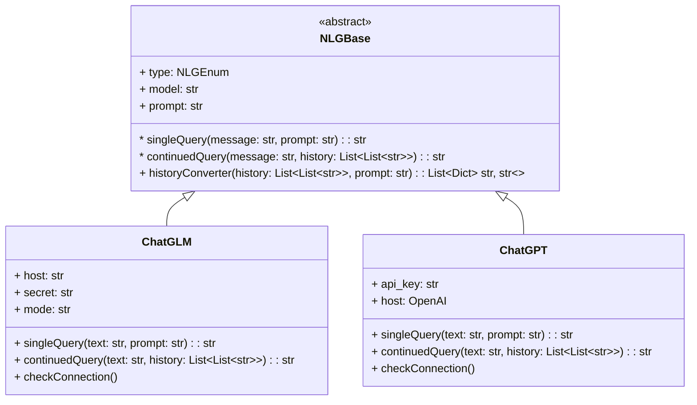

# Modules 关于模块

> 在[/modules](/modules)路径下存放的是各个模块的定义，包括语音识别、语音合成、语言生成等模块，以及各个模块的推理端实现。

* [/ASR.py](./ASR.py) 语音识别模块，包含针对Whisper、Whisper(OpenAI)的类定义

* [/TTS.py](./TTS.py) 语音合成模块，包含针对Bert-VITS2、FastSpeech2、TTS(OpenAI)的类定义

* [/NLG.py](./NLG.py) 语言生成模块，包含针对ChatGLM3、ChatGPT(OpenAI)的类定义

* [/ASR/](./ASR) 语音识别推理端，包括[Whisper-Finetune](https://github.com/Wozzilla/Whisper-Finetune)以及利用APIWrapper实现的推理端调用
  * [asr_server.py](./ASR/asr_server.py) Whisper推理端启动服务代码的拷贝，请以[Whisper](https://github.com/Wozzilla/Whisper)中的[asr_server.py](https://github.com/Wozzilla/Whisper/blob/master/asr_server.py)为准。
  * [requirements.txt](./ASR/requirements.txt) Whisper推理端依赖文件的拷贝，请以[Whisper](https://github.com/Wozzilla/Whisper)中的[requirements.txt](https://github.com/Wozzilla/Whisper/blob/master/requirements.txt)为准。
* [/TTS/](./TTS) 语音合成推理端，包括[~~FastSpeech2~~(已弃用)](https://github.com/Wozzilla/FastSpeech2)、[Bert-VITS2](https://github.com/Wozzilla/Bert-VITS2)以及利用APIWrapper实现的推理端调用
  * [tts_server_bert_vits2.py](./TTS/tts_server_bert_vits2.py) Bert-VITS2推理端启动服务代码的拷贝，请以[Bert-VITS2](https://github.com/Wozzilla/Bert-VITS2)中的[tts_server.py](https://github.com/Wozzilla/Bert-VITS2/blob/master/tts_server.py)为准。
  * [requirements.txt](./TTS/requirements.txt) Bert-VITS2推理端依赖文件的拷贝，请以[Bert-VITS2](https://github.com/Wozzilla/Bert-VITS2)中的[requirements.txt](https://github.com/Wozzilla/Bert-VITS2/blob/master/requirements.txt)为准。
  * [tts_server_fastspeech2.py](./TTS/tts_server_fastspeech2.py) FastSpeech2推理端启动服务代码的拷贝，请以[FastSpeech2](https://github.com/Wozzilla/FastSpeech2)中的[tts_server.py](https://github.com/Wozzilla/FastSpeech2/blob/master/tts_server.py)为准。
* [/NLG/](./NLG) 语言生成推理端，包括[ChatGLM3](https://github.com/Wozzilla/ChatGLM3)以及利用APIWrapper实现的推理端调用
  * [nlg_server.py](./NLG/nlg_server.py) ChatGLM3推理端启动服务代码的拷贝，请以[ChatGLM3](https://github.com/Wozzilla/ChatGLM3)中的[nlg_server.py](https://github.com/Wozzilla/ChatGLM3/blob/master/nlg_server.py)为准。
  * [requirements.txt](./NLG/requirements.txt) ChatGLM3推理端依赖文件的拷贝，请以[ChatGLM3](https://github.com/Wozzilla/ChatGLM3)中的[requirements.txt](https://github.com/Wozzilla/ChatGLM3/blob/master/requirements.txt)为准。